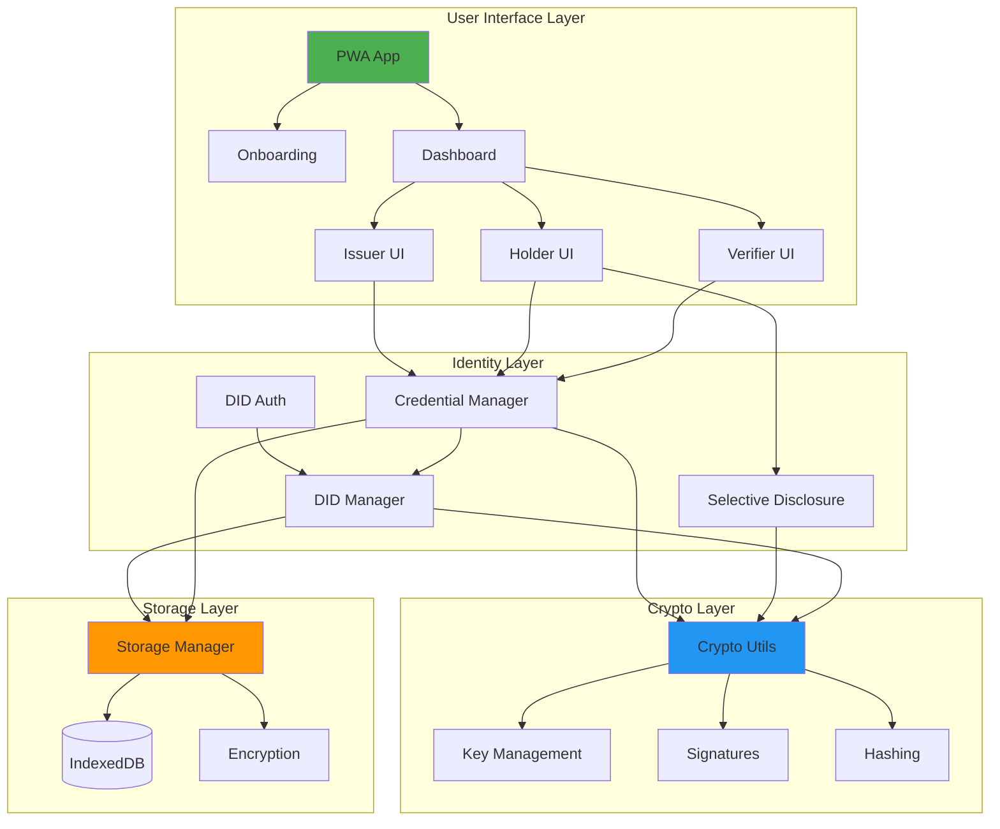
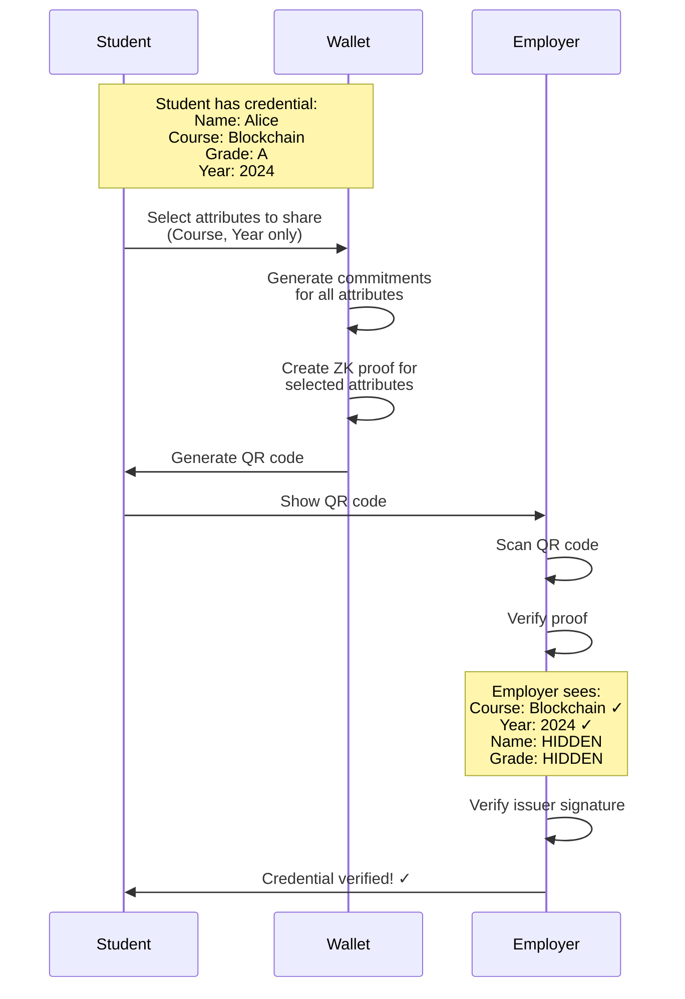

# Self-Sovereign Identity (SSI) Mobile App for Academic Credential Verification

A comprehensive mobile application implementing W3C standards for Decentralized Identifiers (DIDs) and Verifiable Credentials with selective disclosure capabilities using BBS+ signatures.

## Background

Traditional academic credential verification requires sharing entire transcripts and relying on centralized authorities, creating privacy risks and inefficiencies. This SSI mobile app empowers students to control their identity and selectively share academic credentials without revealing unnecessary personal information.

## User Review Required

> [!IMPORTANT]
> **Technology Stack Decision**
> 
> I'm proposing a **Progressive Web App (PWA)** approach instead of a native mobile app for the following reasons:
> 1. **Cross-platform compatibility**: Works on iOS, Android, and desktop with a single codebase
> 2. **No app store requirements**: Can be installed directly from the browser
> 3. **Easier development and testing**: Can test locally on desktop and mobile browsers
> 4. **Modern capabilities**: PWAs support camera access, offline storage, notifications, and can be installed on home screens
> 5. **Better for demonstration**: Easier to showcase and distribute
> 
> The app will be built using:
> - **HTML/CSS/JavaScript** (vanilla) for maximum flexibility
> - **Web Crypto API** for cryptographic operations
> - **IndexedDB** for encrypted local storage
> - **Service Workers** for offline functionality
> 
> If you prefer a native mobile framework like React Native or Flutter instead, please let me know!

> [!IMPORTANT]
> **DID Method Selection**
> 
> For this implementation, I'm proposing **`did:key`** method for the following reasons:
> 1. **No blockchain required**: DIDs are generated directly from cryptographic key pairs
> 2. **Fully decentralized**: No dependency on external ledgers or registries
> 3. **Simple implementation**: Perfect for demonstration and educational purposes
> 4. **Offline-capable**: DIDs can be created and resolved without internet connectivity
> 5. **W3C compliant**: Follows all W3C DID standards
> 
> For production use, you might consider `did:web` (DNS-based) or `did:ion` (Bitcoin-anchored) for better verifiability and trust. Please confirm if `did:key` works for your use case.

> [!WARNING]
> **Cryptographic Library Constraints**
> 
> BBS+ signatures require specialized cryptographic libraries. While the Web Crypto API provides standard operations, BBS+ is not natively supported. I'll implement a simplified selective disclosure mechanism using:
> - **SHA-256 hashing** for commitment schemes
> - **ECDSA signatures** for credential signing
> - **Zero-knowledge proof simulation** for selective attribute disclosure
> 
> For production-grade BBS+ signatures, you'd need to integrate specialized libraries (e.g., `@mattrglobal/bbs-signatures`), which may require Node.js or WASM compilation.

## Proposed Changes

### Core Identity Layer

#### [NEW] [crypto-utils.js](file:///C:/Users/Asus/.gemini/antigravity/scratch/project1/js/crypto-utils.js)
Cryptographic utilities module providing:
- **Key pair generation**: ECDSA key pairs for DID creation
- **DID generation**: `did:key` format based on public keys
- **Signature generation/verification**: For credential signing
- **Hashing functions**: SHA-256 for commitments and proof generation
- **Encryption/decryption**: For secure local storage

#### [NEW] [did-manager.js](file:///C:/Users/Asus/.gemini/antigravity/scratch/project1/js/did-manager.js)
DID lifecycle management:
- **DID creation**: Generate new DIDs with associated key pairs
- **DID storage**: Encrypted storage in IndexedDB
- **DID resolution**: Convert DIDs to DID Documents
- **Key rotation**: Update keys while maintaining DID identity

#### [NEW] [credential-manager.js](file:///C:/Users/Asus/.gemini/antigravity/scratch/project1/js/credential-manager.js)
Verifiable Credential operations:
- **Credential schema**: Academic credential data structure (student info, courses, grades, completion dates)
- **Credential issuance**: Create signed credentials conforming to W3C VC standard
- **Credential storage**: Encrypted storage with metadata indexing
- **Credential verification**: Cryptographic verification of signatures and proof chains
- **Revocation checking**: Status verification (for future implementation)

#### [NEW] [selective-disclosure.js](file:///C:/Users/Asus/.gemini/antigravity/scratch/project1/js/selective-disclosure.js)
Privacy-preserving selective disclosure:
- **Attribute commitment**: Create cryptographic commitments for each credential attribute
- **Proof generation**: Generate zero-knowledge proofs for selected attributes
- **Proof verification**: Verify disclosed attributes without seeing others
- **Predicate proofs**: Prove conditions (e.g., GPA > 3.0) without revealing exact value

---

### Authentication System

#### [NEW] [did-auth.js](file:///C:/Users/Asus/.gemini/antigravity/scratch/project1/js/did-auth.js)
DID-based authentication (passwordless):
- **Challenge generation**: Create authentication challenges
- **Challenge signing**: Sign challenges with DID private key
- **Signature verification**: Verify signed challenges
- **Session management**: Create and manage authenticated sessions
- **Biometric integration**: Optional integration with Web Authentication API

---

### Data Storage Layer

#### [NEW] [storage.js](file:///C:/Users/Asus/.gemini/antigravity/scratch/project1/js/storage.js)
Secure local storage management:
- **IndexedDB wrapper**: Simplified interface for credential and DID storage
- **Encryption layer**: AES-GCM encryption for sensitive data
- **Backup/restore**: Export and import encrypted identity wallet
- **Data migration**: Schema versioning for future updates

---

### User Interface Components

#### [NEW] [index.html](file:///C:/Users/Asus/.gemini/antigravity/scratch/project1/index.html)
Main application shell:
- **App structure**: PWA manifest and service worker registration
- **Routing**: Single-page application navigation
- **Meta tags**: SEO and mobile optimization

#### [NEW] [styles.css](file:///C:/Users/Asus/.gemini/antigravity/scratch/project1/styles.css)
Comprehensive design system:
- **Color palette**: Modern, accessible colors with dark mode support
- **Typography**: Professional fonts optimized for readability
- **Component styles**: Cards, buttons, forms, modals
- **Animations**: Smooth transitions and micro-interactions
- **Responsive design**: Mobile-first, adaptive layouts

#### [NEW] [app.js](file:///C:/Users/Asus/.gemini/antigravity/scratch/project1/js/app.js)
Main application controller:
- **Initialization**: App startup and state management
- **View routing**: Navigate between different screens
- **Event handling**: User interaction management

#### [NEW] [components/onboarding.js](file:///C:/Users/Asus/.gemini/antigravity/scratch/project1/js/components/onboarding.js)
First-time user experience:
- **Welcome screen**: Explain SSI concepts
- **DID creation**: Guide users through identity creation
- **Security setup**: Biometric or PIN setup
- **Backup reminder**: Encourage identity backup

#### [NEW] [components/dashboard.js](file:///C:/Users/Asus/.gemini/antigravity/scratch/project1/js/components/dashboard.js)
Main user dashboard:
- **Identity overview**: Display user's DID and status
- **Credential list**: Show all stored credentials
- **Quick actions**: Issue, receive, share credentials
- **Recent activity**: Transaction history

#### [NEW] [components/credential-issuer.js](file:///C:/Users/Asus/.gemini/antigravity/scratch/project1/js/components/credential-issuer.js)
Credential issuance interface (simulated university portal):
- **Student form**: Input academic information
- **Course management**: Add/edit course credentials
- **Credential preview**: Review before signing
- **Issuance confirmation**: Display issued credential

#### [NEW] [components/credential-holder.js](file:///C:/Users/Asus/.gemini/antigravity/scratch/project1/js/components/credential-holder.js)
Credential management for students:
- **Credential details**: View credential information
- **Selective disclosure**: Choose which attributes to share
- **QR code generation**: Create shareable credential presentations
- **Delete/archive**: Manage credential lifecycle

#### [NEW] [components/credential-verifier.js](file:///C:/Users/Asus/.gemini/antigravity/scratch/project1/js/components/credential-verifier.js)
Verification interface (for employers/institutions):
- **QR scanner**: Camera access for credential scanning
- **Manual verification**: Paste credential presentation
- **Verification result**: Display verified attributes
- **Trust indicators**: Show issuer information and signature status

---

### PWA Infrastructure

#### [NEW] [manifest.json](file:///C:/Users/Asus/.gemini/antigravity/scratch/project1/manifest.json)
PWA manifest for mobile installation:
- **App metadata**: Name, description, icons
- **Display mode**: Standalone app appearance
- **Theme colors**: Match app branding
- **Orientation**: Portrait for mobile

#### [NEW] [service-worker.js](file:///C:/Users/Asus/.gemini/antigravity/scratch/project1/service-worker.js)
Offline functionality:
- **Cache strategy**: Cache-first for static assets
- **Offline fallback**: Graceful degradation
- **Background sync**: Queue operations when offline

---

### Assets

#### [NEW] [icons/](file:///C:/Users/Asus/.gemini/antigravity/scratch/project1/icons/)
App icons for various platforms:
- **icon-192.png**: Android icon
- **icon-512.png**: High-res icon
- **favicon.ico**: Browser favicon

## Verification Plan

### Automated Tests

1. **Cryptographic Operations**
   ```bash
   # Open browser console and run tests
   # Test key generation, signing, verification
   ```

2. **DID Creation and Resolution**
   - Create a new DID
   - Verify DID format follows `did:key` specification
   - Resolve DID to DID Document
   - Verify DID Document contains correct public key

3. **Credential Issuance**
   - Issue a sample academic credential
   - Verify credential structure matches W3C VC Data Model
   - Verify cryptographic signature on credential
   - Store credential in wallet

4. **Selective Disclosure**
   - Create a credential presentation with only selected attributes (e.g., course name, not grade)
   - Verify that undisclosed attributes are not visible
   - Verify that disclosed attributes can be cryptographically verified

5. **DID Authentication**
   - Test challenge-response authentication flow
   - Verify signature verification
   - Test session management

### Browser Tests

1. **Onboarding Flow**
   - Navigate through welcome screens
   - Create first DID
   - Set up security (PIN/biometric simulation)
   - Back up identity

2. **Issuer Flow (University Portal Simulation)**
   - Login as issuer
   - Fill in student academic information
   - Add multiple course credentials
   - Issue signed credentials
   - Verify credential appears in holder's wallet

3. **Holder Flow (Student)**
   - View credential details
   - Select specific attributes to share (e.g., "Course: Blockchain", "Grade: Hidden")
   - Generate QR code or shareable link
   - Verify presentation shows only selected fields

4. **Verifier Flow (Employer/Institution)**
   - Scan/paste credential presentation
   - Verify cryptographic signatures
   - View only disclosed attributes
   - See issuer trust information

### Manual Verification

1. **Mobile Testing**
   - Test on mobile browser (Chrome/Safari)
   - Verify responsive design
   - Test PWA installation
   - Test offline functionality

2. **User Experience**
   - Verify smooth animations and transitions
   - Test all navigation flows
   - Ensure clear explanations of SSI concepts
   - Verify error handling and user feedback

3. **Security Review**
   - Verify credentials are encrypted in storage
   - Verify private keys never leave the device
   - Test backup and recovery flow
   - Verify selective disclosure doesn't leak information

4. **Standards Compliance**
   - Verify DID format matches W3C DID Core specification
   - Verify Verifiable Credential matches W3C VC Data Model
   - Verify cryptographic operations use standard algorithms

## Architecture Diagram



## Data Flow: Selective Disclosure Example


